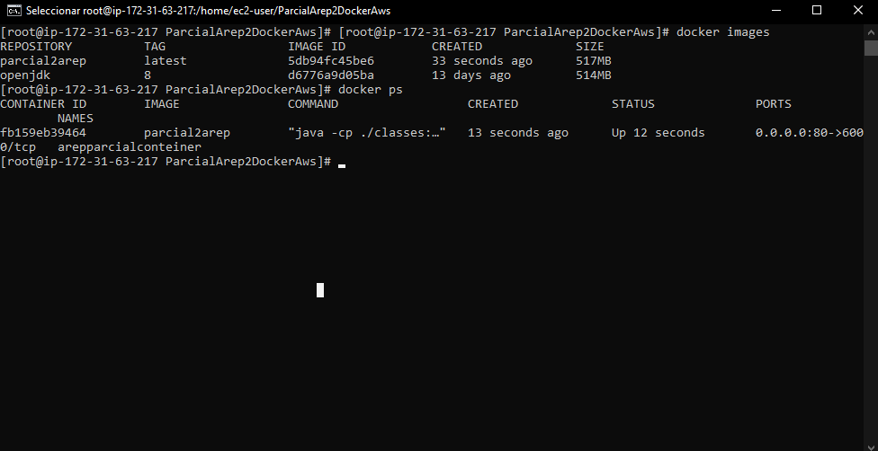

# Parcial Segundo conrte AWS Y Docker

## Autor: Juan Sebastian Ramos Isaza

## Fecha: 26-03-2021

### Prerequisitos
Para el uso de esta aplicación se necesitan tener instalados los siguientes componentes:

* [Java 11 o superior](https://www.oracle.com/co/java/)
* [maven](https://maven.apache.org/)
* [git](https://git-scm.com/)
* [docker y docker-compose](https://www.docker.com/)

### Uso 
Para el uso de la apliacion deben clonar el repositorio en su maquina con el comando:
* git clone 

Deberan entrar en el directorio del repositorio y ejecutar el siguiente comando
*  mvn package

Para generar la imagen de docker debe ejecutar 
* docker build --tag parcial2arep .

para generar el contenedor deben ejecutar 
* docker run -d -p 80:6000 --name arepparcialconteiner parcial2arep

Para usar la aplicacion deberan entrart a localhost/atan?value=<numero> o localhost/ln?value=<numero>
## video 

https://youtu.be/3WMtuh5fw4o en este enlace encontrara el video demostracion de la apliacacion montada en ec2 aws con dokcer

### Javadoc
La documentación se encuentra en el directorio apidocs dentro el directorio Robin y LogService, para generar una nueva documentación
pueden hacer uso del comando mvn javadoc:javadoc en su Shell esta se generará en el directorio target/site.

### Licencia

En este proyecto se usó la licencia GNU - se puede ver [LICENSE.txt](LICENSE.txt) para más detalles.
